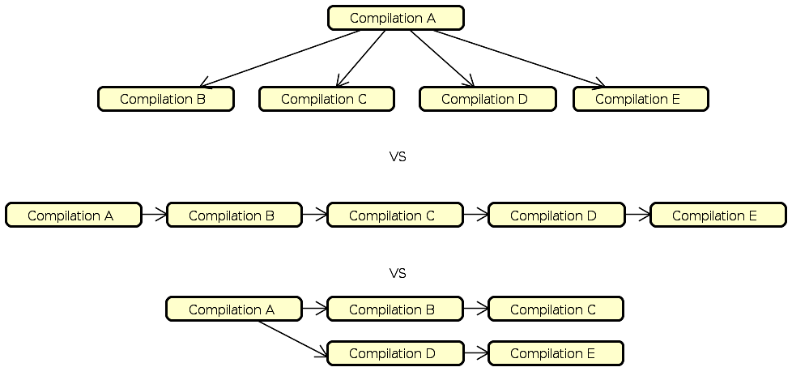

# Database status
## 1. Introduction

When refactoring the whole core project, we stumble upon the database part,
which provide a data set for Machine Learning algorithm.

The whole database consist in two main tables : *compilations* and
*incremental_compilations*.

**Note** : We will mark Primary Key with **bold** font and will mark Foreign Key
with _field_name_(table.field_name_origin). When both, it will be a fusion of
the 2.

The two tables tables are divided as follow :

- compilations

| Field |  Type  | Meaning |
| ----- | ------ | ------- |
| **cid** | int(11) | The unique id of each compilation made. It stands for *c*ompilation *id*. Note that each compilation are unique, but the result can be redundant.        |
| compilation_date | datetime | When the compilation have been made. |
| compilation_time | float | How many time have elapsed during the compilation. If negative, it mainly means that the compilation failed. Time is in seconds. |
| config_file | longblob | The configuration file used to specify the Linux kernel configuration. Present in a compressed form. |
| stdlog_file | longblob | The standard output of the compilation, different from what was display to the user. |
| errlog_file | longblob | The error output of the compilation, different from what was display to the user.
| output_file | longblob | What are display to the user. |
| core_size | int(11) | The size of the compiled kernel. Will be 0 if the compilation failed. Size is in Byte. |
| compressed_size | text | The size of the compiled kernel, depending on the compression algorithm used. Size is in Byte. |
| dependencies | longtext | All package present on the docker image in order to successfully compile the kernel. |
| gcc_version | varchar(32) | Version of the GCC and G++ compiler. |
| libc_version | varchar(32) | Version of the LDD linker. |
| core_used | int(11) | The number of cores used during the compilation. |
| incremental_mod | tinyint(1) | States if this compilation have been made in incremental mode. |
| tuxml_version | varchar(32) | The version of TuxML when doing this compilation. |
| git_branch | varchar(32) | (?) Always blank. |
| docker_image | varchar(32) | (?) Always blank. |
| os | varchar(32) | The system kernel on which we compile. Could be Linux, Windows, MacOS or Java. |
| distribution | varchar(32) | Assuming we are using Linux, the distribution name (e.g. debian, fedora, ...). |
| distrib_version | varchar(32) | Assuming we are using Linux, the distribution version. |
| kernel | varchar(32) | The system kernel version. |
| arch | varchar(32) | The architecture on which we are running the compilation and for which we compile (e.g. x86_x64, arm64, ...). |
| cpu | varchar(128) | The brand name of the cpu which is used for the compilation. |
| cpu_cores | int(11) | The total number of thread available for this CPU. |
| cpu_freq | varchar(32) | A sample of this cpu frequencies. |
| ram | int(11) | The ram size, in kB. |
| mechanical_drive | tinyint(1) | Determine if we are using an HDD or something else. |

- incremental_compilations

| Field |  Type  | Meaning |
| ----- | ------ | ------- |
| **_cid_incmod_**(compilations.cid) | int(11) | The corresponding **cid** of a compilation made with incremental mode. |
| **_cid_origin_**(compilations.cid) | int(11) | The corresponding **cid** of the compilation which resulting object file are reused to compile the **_cid_incmod_**. |

## 2. Problematics

This design present some flaws :

- The database size : for each compilation, we have a record for every field
which isn't size compliant, because the database size can explode easily and
some record are a lot redundant.
- The naming : some field name could be enigmatic, even if we know what we are
working with. Also, they can lead to some ambiguity : for example, the _kernel_
field is about the kernel name, kernel version, the kernel on which we compile,
the kernel that we compile, etc.
- The relevance : some field lack accuracy or are interdependent. For example,
the _cpu\_freq_ field is the actual frequency of the cpu before the compilation.
It will be more useful to know the actual range of frequency for the processor
rather than some value which isn't really relevant with the compilation.
- Extensibility : right now, we are try to include some new field, about 
different version of linux kernel we want to compile, or the boot time and boot
log. But it will need to be added directly to the compilations table, which
already contains a lot of data and will take time to modify.

## 3. Proposition

In order to respond to this flaws, we will propose a division in five different
table.

**Note** : From now on, all fields and tables name will follow Snake case with
no uppercase. (If you don't what is it : <https://en.wikipedia.org/wiki/Snake_case>)

- compilations : From the old compilations table, retains field which is
directly related to the compilation result.

| Field | Type | Explanations |
| ----- | ---- | ------------ |
| **cid** | int(11) | |
| compilation_date | datetime | |
| compilation_time | float | |
| config_file | longblob | |
| stdout_log_file | longblob | Old field _compilations.stdlog\_file_. |
| stderr_log_file | longblob | Old field _compilations.errlog\_file_. |
| user_output_file | longblob | Old field _compilations.output\_file_. |
| compiled_kernel_size | int(11) | Old field _compilations.core\_size_.|
| compressed_compiled_kernel_size | text | Old field _compilations.compressed\_size_. |
| dependencies | longtext | Old field _compilations.dependencies_. Note that it is compilation dependent because it can contain additional package who aren't present on the base docker image. |
| number_cpu_core_used | int(11) | Old field _compilations.core\_used_. |
| compiled_kernel_version | varchar(32) | The version of the kernel we compile. It's a new field, and it allow us to prepare for multiple version of the Linux kernel. |
| _sid_(software\_environment.sid) | int(11) | See software_environment table for more. |
| _hid_(hardware\_environment.hid) | int(11) | See hardware_environment table for more. |

- incrementals_compilations_relation : it retains the same information as the
old incrementals_compilations.

| Field | Type | Explanations |
| ----- | ---- | ------------ |
| **_cid_**(compilations.cid) | int(11) | |
| **_cid\_base_**(compilations.cid) | int(11) | |
| incremental_level | int(3) | Old field _compilations.incremental\_mod_. See explanation below for more. |

Why incremental_level? Actually, when we use the incremental mode, we use the
first compilation result as a base for all the other, which is an
incremental_level of one. Therefore, if we want to make a chain of compilation,
it will only add an incremental_level (2+).

- hardware_environment : Since each hardware is unique but can be same across
some compilations, we create a table for each specific hardware, which is link
to some cid. This behaviour could retain a lot of database size.

| Field | Type | Explanations |
| ----- | ---- | ------------ |
| **hid** | int(11) | The unique hardware id. |
| architecture | varchar(32) | Old field _compilations.arch_. |
| cpu_brand_name | varchar(128) | Old field _compilations.cpu_. |
| number_cpu_core | int(11) | Old field _compilations.cpu\_core_. |
| cpu_max_frequency | varchar(32) | |
| ram_size | int(11) | Old field _compilations.ram_. |
| mechanical_disk | boolean | Old field _compilations.mechanical\_drive_. |

Why boolean instead of tinyint(1) : <https://dev.mysql.com/doc/refman/8.0/en/numeric-type-overview.html>.
TLDR: Boolean type is similar to tinyint(1) but carry a lot more meaning than
tinyint(1).

- software_environment : As the hardware, the software shouldn't change a lot
across all the compilation, so we apply the same behaviour.

| Field | Type | Explanations |
| ----- | ---- | ------------ |
| **sid** | int(11) | The unique software id. |
| system_kernel | varchar(32) | Old field _compilations.os_. |
| system_kernel_version | varchar(32) | Old field _compilations.kernel_. |
| linux_distribution | varchar(32) | Old field _compilations.distribution_. Note that it will be empty if the kernel isn't Linux. |
| linux_distribution_version | varchar(32) | Old field _compilations.distrib\_version_. Note that it will be empty if the kernel isn't Linux. |
| gcc_version | varchar(32) | Old field _compilations.gcc\_version_. |
| libc_version | varchar(32) | Old field _compilations.libc\_version_. |
| tuxml_version | varchar(32) | Old field _compilations.tuxml\_version_. |

- boot : This database will retain boot testing result, if only the test has be
done.

| Field | Type | Explanations |
| ----- | ---- | ------------ |
| **_cid_**(compilations.cid) | int(11) | |
| boot_time | int(11) | The time spend to boot the kernel. Will be negative if the kernel hasn't be able to boot. |
| boot_log_file | longblob | The log of the boot. |

- other table ? : in the future, each new test or new functionality could be added
as a new table, which we will not have a huge impact on the existent database
and respect an easier way to extend the project result.
